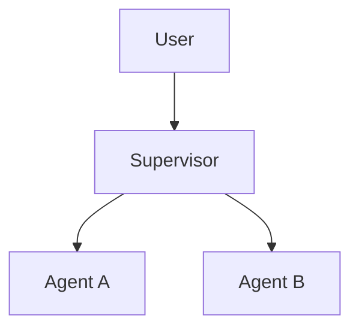

# Agent topology

Skip if ADR 0013 is a single model call or “no agent”.

```mermaid
flowchart TD
  user[User] --> supervisor[Supervisor]
  supervisor --> a[Agent A]
  supervisor --> b[Agent B]
```
