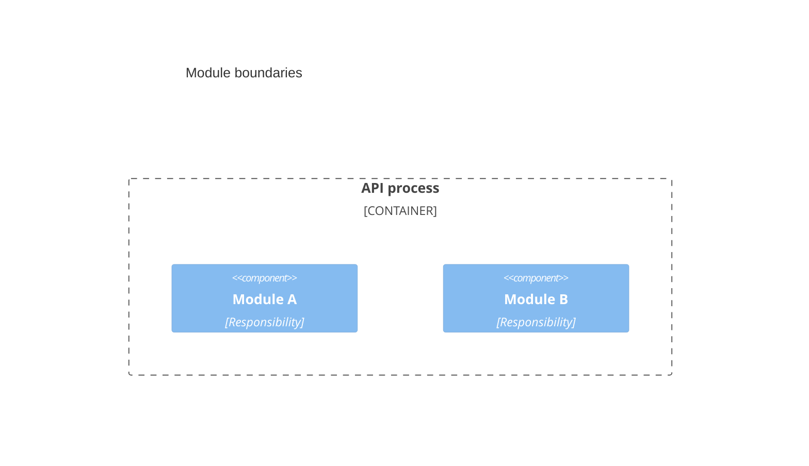

# C4 component

Write this only if the system-decomposition ADR chose a modular monolith or services.

```mermaid
C4Component
  title Module boundaries
  Container_Boundary(api, "API process") {
    Component(modA, "Module A", "Responsibility")
    Component(modB, "Module B", "Responsibility")
  }
```
