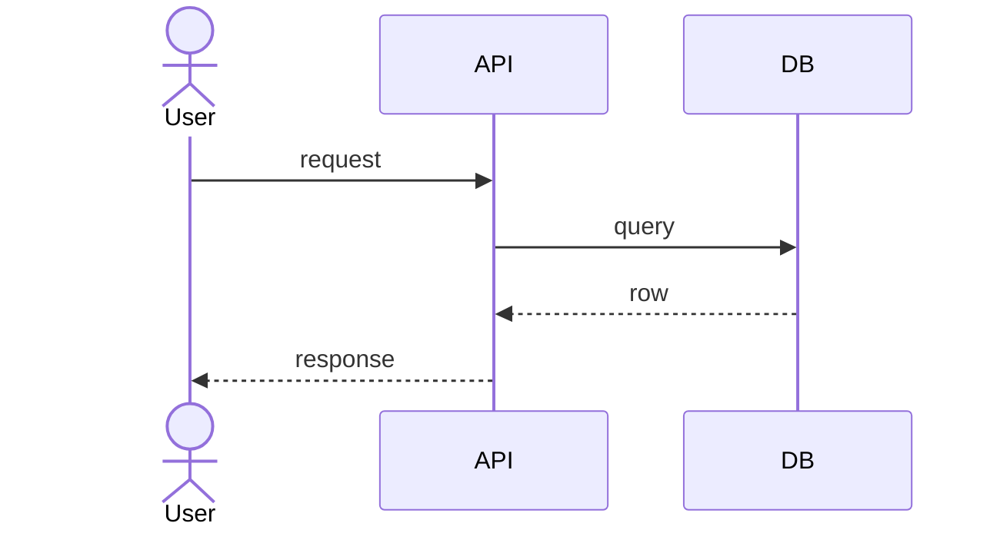

# Sequences

Add a diagram only for a PRD-critical or security-sensitive flow.

```mermaid
sequenceDiagram
  actor User
  participant API
  participant DB
  User->>API: request
  API->>DB: query
  DB-->>API: row
  API-->>User: response
```
